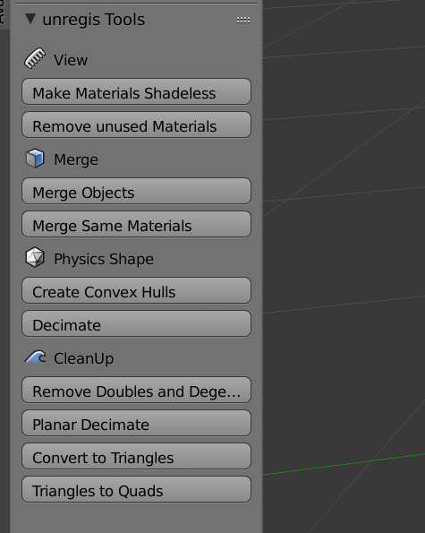

# unregis Tools
Blender AddOn and script (does the same thing as the AddOn) for optimizing and simplfying meshes for blender for use in OpenSim and SL.

## What do the buttons do

- Make Materials Shadeless
Sets all materials to shadeless for the sole purpose to see all details in Material view
- Remove unused materials
Removes materials that do not get used (same thing happenes if you save a file and open it again)

- Merge Objects:
Join all selected object with preserving of the UVmaps
- Merge Same Materials:
Merge Materialslots in the selected object together that use the same texture

- Create Convex Hulls:
Convert all objects selected to convex hulls, deleting their materials
- Decimate:
Applies Collapse Decimate Modifier to all selected objects

- Remove Doubles and Degenerates:
Does said thing in all selected objects
- Planar Decimate:
Applies Planar Decimate Modifier to all selected objects, giving you the option to change the max angle
- Convert to Triangles:
Does said thing in all selected objects
- Triangles to Quads:
Does said thing in all selected objects

## Installation

1. Download unregis-addon.py
2. Open Blender
3. Go to File -> User Preferences -> Add-ons
4. Click on "Install Add-on from file" and select unregis-addon.py
5. Check the checkbox on the new appearing "Mesh:unregis AddOn" to activate it
5. Now you have new buttons in the 3d view when in object mode

## Caveats about SL/OpenSim

- In SL one material is one "face" and one object can have 8 faces max. The less objects the better.

- The link order is determinded by the order in the collada file (select "sort by object name" on collada export, or you will get a random order).

- No n-gons allowed, Make sure the mesh consists only of tris and quads (to make sure of that, first convert the mesh to tris and then use the tris-to-quads function).

- LOD models have to use the same amounts of materials as the original model.

- When generating LODs by the Uploader, it will create degenerate triangles with 0 area for some materials that it would have removed otherwise.
This means that using the LOD model as physics model is discouraged, because degenerate triangles are bad for physics.

- The Analyze button in the Physics tab, that is supposed to create a optimized convex shape out of the physics shape, generates Havok specific meshes that are unusable in other environments like OpenSim.

- Creating an own physics shape (with shapes being convex if possible) is recommended. Blender has a convex hull function (press space in Edit mode and type it). The smallest possible useful physics shape would therefor be one convex hull shape per object that is decimated to 4 triangles (smallest possible manifold object). Having a good physics shape solves lots of random weird upload failures.

- Worn rigged mesh is displayed differently by viewers than unrigged mesh. The Low and Lowest LOD levels of rigged mesh never gets shown, so those can be 0 without problems.
